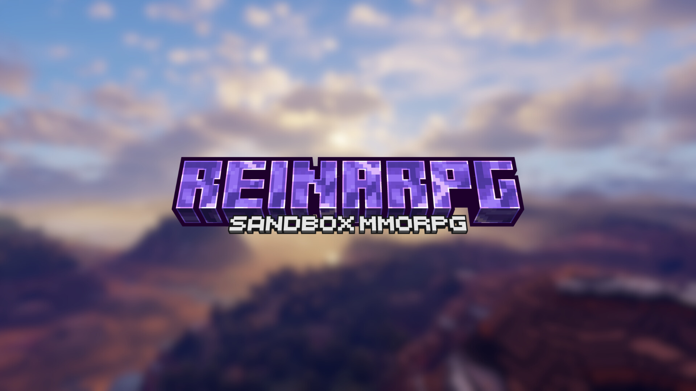

  

  
  
  <a href="https://choosealicense.com/licenses/mit/">
  

<h3 align=center>ReinaRPG is browser based voxel sandbox MMORPG</h3>
 

# The experience

Create an account, login to your world, invite your friends, visit others worlds,
gain items and xp from PvP and PvE. Chat with other players!

- https://reinarpg.com

# Contribute
### Main Repositories
- [Web Client](https://github.com/reinarpg/reinarpg-app)
- [Game Server](https://github.com/reinarpg/reinarpg-server)
- [Game Data](https://github.com/reinarpg/reinarpg-data)
- [Client/Bot API](https://github.com/reinarpg/reinarpg-bot)
- [Protocol](https://github.com/reinarpg/reinarpg-protocol)

### Lib Repositories
- [Chunk](https://github.com/reinarpg/reinarpg-chunk)
- [NBT](https://github.com/reinarpg/reinarpg-nbt)
- [Item](https://github.com/reinarpg/reinarpg-item)
- [Block](https://github.com/reinarpg/reinarpg-block)
- [World](https://github.com/reinarpg/reinarpg-world)
- [RNG](https://github.com/reinarpg/reinarpg-rng)
- [Entity](https://github.com/reinarpg/reinarpg-entity)
- [Anvil (Storage)](https://github.com/reinarpg/reinarpg-anvil)
# Try the game

Head over to https://reinarpg.com, or the beta test at https://beta.reinarpg.com

# Contact

If you have any questions/feedback and would like to directly connect to the team, join our [discord](https://discord.gg/zU9PZ2jS)
